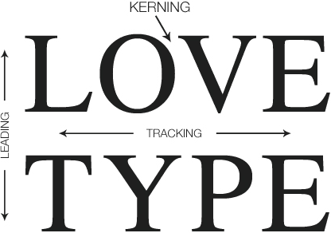
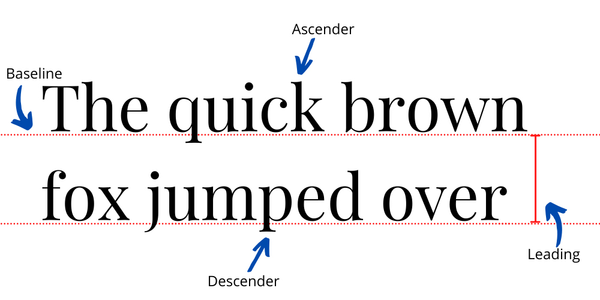
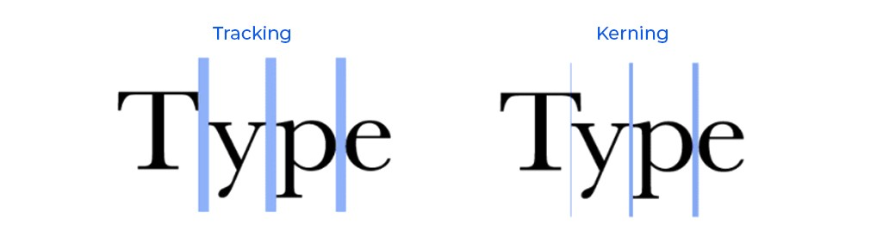
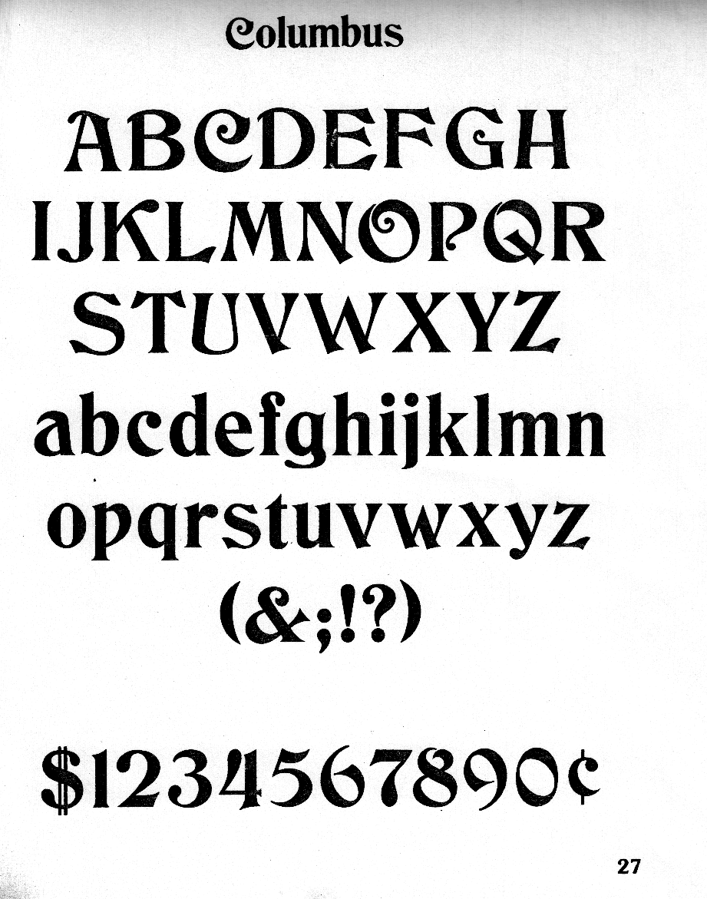

## Table of Contents
1. [What is Core Text](#What-is-Core-Text)
2. [Glyph](#Glyph)
3. [CTFontDescriptor](#CTFontDescriptor)
4. [CTFont](#CTFont)
5. [CTFontCollection](#CTFontCollection)
6. [CTFrameSetter](#CTFrameSetter)
7. [CTFrame](#CTFrame)
8. [CTTypeSetter](#CTTypeSetter)
9. [CTRun](#CTRun)
10. [CTLineDelegate](#CTLineDelegate)
11. [CTParagraphStyle](#CTParagraphStyle)
12. [CTGlyphInfo](#CTGlyphInfo)
13. [References](#References)

## What is Core Text?
Core Text is a low-level framework that provides a set of functions and objects to render and display text with font features.

## Features
- Allows text rendering with custom fonts
- Provides different layout options, such as:
  - Rectangle bounds
  - Bezier paths
- Gives full access to font metrics, including:
  - Kerning
  - Glyph data

## Thread Safety
- All Core Text functions are **thread-safe**, meaning they can be used across multiple threads or operations.
- However, this does **not** apply to groups of objects.  
  Objects related to layout must be used with a **single thread** only:
  - TypeSetter  
  - FrameSetter  
  - Run  
  - Frame  
  - Line





# Glyph

## What is a Glyph?
A glyph is the graphical shape of a character in a font.  
For example, the character **A** will have a specific shape depending on the font.

## Key Points
- Each glyph is stored with a unique **index** in the font.
- For example, a character **x** might be stored at index **100**.



# Core Text Features

## CTFontDescriptor
- A **CTFontDescriptor** is a collection of font attributes, such as:
  - Font name
  - Size
  - Variations (e.g., bold, italic)

- These attributes are stored in a **dictionary** structure.

- You don’t need to provide all attributes of a font.  
  For example, if you only specify the font name, the system will return the closest matching font.

- When we say "attributes," we mean properties like:
  - Bold or italic style
  - Font name
  - Font size
  - And more...


## CTFont
- A **CTFont** is the actual font object that contains all the properties of a font, such as:
  - Font name
  - Size
  - Transformation matrix
  - And more...

- Its role is to define **how glyphs should be positioned** when rendering text.

```swift
func CTFontCreateWithFontDescriptor(CTFontDescriptor, CGFloat, UnsafePointer<CGAffineTransform>?) -> CTFont
// Returns a new font reference that best matches the given font descriptor.

func CTFontCreateWithName(CFString, CGFloat, UnsafePointer<CGAffineTransform>?) -> CTFont
// Returns a new font reference for the given name.

func CTFontCreateUIFontForLanguage(CTFontUIFontType, CGFloat, CFString?) -> CTFont?
// Returns the special user-interface font for the given language and user-interface type.

func CTFontCreateCopyWithSymbolicTraits(CTFont, CGFloat, UnsafePointer<CGAffineTransform>?, CTFontSymbolicTraits, CTFontSymbolicTraits) -> CTFont?
// Returns a new font in the same font family as the original with the specified symbolic traits.
```

```swift
let fontName: CFString = "Helvetica" as CFString
let fontSize: CGFloat = 18.0

let ctFont = CTFontCreateWithName(fontName, fontSize, nil)

// Getting Information of Font
print("Font name:", CTFontCopyFullName(ctFont))
print("Point size:", CTFontGetSize(ctFont))
print("Ascent:", CTFontGetAscent(ctFont))
print("Font Family:", CTFontCopyFamilyName(ctFont))
print("Matrix:", CTFontGetMatrix(ctFont))
print("Supported Language:", CTFontCopySupportedLanguages(ctFont))
```

## CTFontCollection
- A **CTFontCollection** is a set of font descriptors.  
- Each descriptor in the collection can be used to create a font.

```swift
func CTFontCollectionCreateFromAvailableFonts(CFDictionary?) -> CTFontCollection
// Returns a new font collection containing all available fonts.

func CTFontCollectionCreateCopyWithFontDescriptors(CTFontCollection, CFArray?, CFDictionary?) -> CTFontCollection
// Returns a copy of the original collection augmented with the given new font descriptors.
```

## CTFrameSetter
- A **CTFrameSetter** is an object used to create a **CTFrame**.  

### How it works
1. It receives a set of **attributes**.  
2. It processes these attributes using a **CTTypeSetter**.  
3. As output, it produces a **CTFrame**, which contains an array of **CTLine** objects.


```swift
func CTFramesetterCreateWithAttributedString(CFAttributedString) -> CTFramesetter
// Creates an immutable framesetter object from an attributed string.

func CTFramesetterCreateWithTypesetter(CTTypesetter) -> CTFramesetter
// Creates a framesetter directly from a typesetter.

func CTFramesetterCreateFrame(CTFramesetter, CFRange, CGPath, CFDictionary?) -> CTFrame
// Creates an immutable frame using a framesetter.

func CTFramesetterGetTypesetter(CTFramesetter) -> CTTypesetter
// Returns the typesetter object being used by the framesetter.
```

## CTFrame
- A **CTFrame** is a text frame that contains multiple lines of text.  
- Each frame is built from an array of **CTLine** objects.

```swift
func CTFrameGetStringRange(CTFrame) -> CFRange
// Returns the range of characters originally requested to fill the frame.

func CTFrameGetVisibleStringRange(CTFrame) -> CFRange
// Returns the range of characters that actually fit in the frame.

func CTFrameGetPath(CTFrame) -> CGPath
// Returns the path used to create the frame.
```

## CTTypeSetter
- A **CTTypeSetter** is responsible for breaking text into the lines that need to be displayed.

### How it works
1. It receives an **AttributedString** as input.  
2. It produces one or more **CTLine** objects as output.

### Processing steps
1. Convert characters into **glyphs**  
2. Arrange glyphs according to **left-to-right** or **right-to-left** text direction  
3. Adjust for **kerning, tracking, and baseline**

## CTRun
- A **CTRun** is a consecutive sequence of glyphs that share the same attributes, such as:
  - Font
  - Color
  - Text direction

- If glyphs have different attributes, they must be placed in a separate **CTRun**.  

- In the end, **CTRun** objects are stored as an array inside a **CTLine**.

```swift
func CTRunGetGlyphCount(CTRun) -> CFIndex
// Gets the glyph count for the run.
```

## CTLineDelegate
- A **CTLineDelegate** is used when we want to adjust the attributes of glyphs.  

### Examples of adjustments:
- **Width**  
- **Ascent**  
- **Descent**

```
CTFontDescriptor → CTFont → CTTypeSetter → CTRun → CTLine → CTFrame
```

## CTParagraphStyle
- A **CTParagraphStyle** is used to apply general settings to a block of text or a paragraph.

## CTGlyphInfo
- Each font has a **mapper** that converts Unicode characters into **glyph IDs**. 

```swift
func CTGlyphInfoGetTypeID() -> CFTypeID
// Returns the Core Foundation type identifier of the glyph info object

func CTGlyphInfoCreateWithGlyphName(CFString, CTFont, CFString) -> CTGlyphInfo?
// Creates an immutable glyph info object with a glyph name.

func CTGlyphInfoCreateWithGlyph(CGGlyph, CTFont, CFString) -> CTGlyphInfo?
// Creates an immutable glyph info object with a glyph index.

func CTGlyphInfoCreateWithCharacterIdentifier(CGFontIndex, CTCharacterCollection, CFString) -> CTGlyphInfo
// Creates an immutable glyph info object with a character identifier.

func CTGlyphInfoGetCharacterIdentifier(CTGlyphInfo) -> CGFontIndex
// Gets the character identifier for a glyph info object.
```

### Example
- When typing the character **A**, it might be mapped to glyph ID **37**.  

- Using **CTGlyphInfo**, we can customize this Unicod


# References
- [Core Text](https://developer.apple.com/documentation/coretext/)